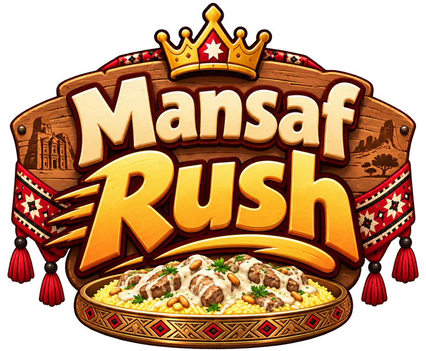

# Mansaf Rush 🍚

[](https://github.com/Shefaa-atef/mansaf-rush/actions/workflows/pages.yml)

**[Play it now →](https://shefaa-atef.github.io/mansaf-rush/)**

A one-handed, single-player race to finish a shared plate of mansaf before three bots do. Scoop rice off the platter, roll it into a lokma, and eat it, in Jordanian Arabic or English. Built with React, TypeScript, Three.js and React Three Fiber; the hand is hand-authored geometry with finger pivots, no imported rig or physics engine.



## How to play

| Key | Does |
|---|---|
| Arrow keys | Move your hand over the platter, and steer while scooping or rolling |
| Hold **SPACE** | Scoop rice from under your hand |
| Release **SPACE** | Lock the scoop |
| Hold **SPACE** again | Roll the lokma; tap **←/→** while holding it |
| **↑** | Eat the lokma |

There's no gauge while you scoop, just a badge once you've taken enough. Letting go of **SPACE** locks the scoop size, and only then does holding **SPACE** again start rolling, so steering can never squash a bite by accident. A press of **↑** just before the last roll finishes is remembered and served automatically once it settles.

Once you're rolling, a green/red gauge tracks the lokma's shape. How many rolls it takes to go round depends on how much you scooped, from about six rolls for a small pinch up to eleven for a full palm, and the counter on screen shows how many are left. It stays round for four more rolls, and the one after that squashes it.

Scoop over a piece of lamb or an almond and it comes off the tray into your lokma, for extra points, but only if you actually picked it up. Three bots scoop, roll and eat on their own at the same platter, and the round ends the moment it runs out, win or lose.

### Scoring

| Bite | Points |
|---|---|
| Round lokma | rice taken + 4 |
| Squashed lokma | rice taken + 1 |
| Under 4 seconds, round only | +3 |
| Lamb picked up | +3 |
| Almond picked up | +2 |

## Run it locally

Requires Node 24+ (tests use its native TypeScript support).

```sh
npm install
npm run dev
```

```sh
npm run build             # production build
npm run preview           # serve the build locally
node --test tests/*.test.mjs
```

`PlayerHand.tsx` handles projection and the eating sequence, `SculptedHand.tsx` defines the seven finger/wrist poses, `lokma.ts` holds the scoop, roll and scoring rules, and `MansafPlatter.tsx` renders the shared, progressively depleted food.

## Deployment

Every push to `main` runs [`.github/workflows/pages.yml`](.github/workflows/pages.yml): it builds the project and publishes `dist/` to GitHub Pages automatically. There's nothing else to configure to ship a change.

## Architecture notes

### Loading and assets

The first paint is the lobby only. The 3D scene (three.js, react-three-fiber, the models and textures) is a separate chunk that `main.tsx` loads once the lobby has painted and the browser is idle, or as soon as the player hovers or presses Play. Keep it that way:

- Never import three.js, or anything that imports it, statically from `main.tsx`. Plain numbers `main.tsx` needs go in a light module such as `botTiming.ts`. Everything that needs the engine sits behind `GameCanvas.tsx`.
- The game only ships the compressed copies in `src/assets/web/`. The files in `src/assets/` are the source art (there's no `.blend` for the models) and are never shipped directly.
- After changing an original, regenerate its compressed copy: `npm i --no-save sharp ffmpeg-static @gltf-transform/core @gltf-transform/extensions @gltf-transform/functions meshoptimizer`, then `node tools/optimize-assets.mjs` (or `images`/`audio`/`models`). The script checks every optimized model against its source and fails if triangles or data drift.
- Optimized models use meshopt compression, so load them through `createGLTFLoader()` in `src/gltf.ts`. The player arm keeps only the pose morphs the game drives; add a name to `KEEP_ARM_POSES` in the script if a new one is needed.
- `sceneAssets.ts` lists every file the scene fetches, so they download in parallel with the scene chunk. Add new scene models or textures there.
- Nothing stands in for a model that hasn't loaded yet: seats stay empty and `main.tsx` holds the round back until every model is in (`sceneReadiness.ts`). Don't bring back placeholder characters.

### Frame rate

The game is CPU-bound, so per-frame work is what to watch:

- Every hand (yours and the three bots') is checked against the food every frame, and a bot solves up to eight passes. Use `contactLift` in `handContact.ts` with the `foodTopBound` ceiling for that, not three.js's per-vertex `getVertexPosition`/`localToWorld`. Refresh only the arm that moved (`updateWorldMatrix(false, true)`), not the whole character.
- `foodObstacleHeight` and `foodSurface` in `MansafPlatter.tsx` are hot paths: keep them free of allocation and full scans (the nearest patch comes from a precomputed grid).
- The tray (each rice patch, the grains, the sauce) rebuilds only when `platterFood.trayVersion` changes, i.e. when a patch of rice runs out or a lamb piece or almond is taken, never on every scoop.
- `GameCanvas` is memoized and `main.tsx` gives it stable props, so the scene isn't re-described every frame. Screen state is published about 30 times a second instead.
